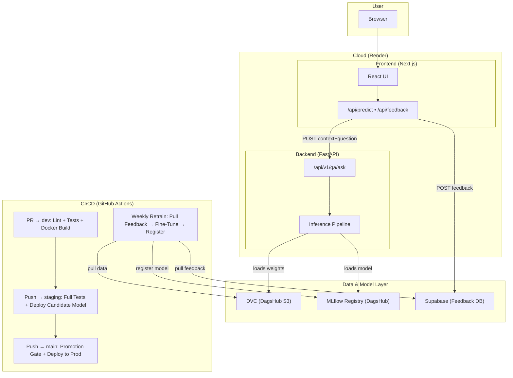

# Document QA Assistant: NLP & MLOps Final Project

> **Production URL**: [https://qa-frontend-prod-ylge.onrender.com](https://qa-frontend-prod-ylge.onrender.com)

This repository contains the integrated final project for the Master 2 (M2) courses: **"Natural Language Processing"** and **"MLOps"**.

The objective is to develop a Closed-Domain Question Answering (QA) neural network and deploy it as a production-grade Web Application. This project demonstrates the full MLOps lifecycle: data versioning, model training & evaluation, model registry & promotion, CI/CD with guard gates, and reproducible cloud deployments.

## Contributors
Project realized by a team of 3 students: **Alon DEBASC**, **Axel STOLTZ**, and **Thibault CHESNEL** under the supervision of instructor **Khodor Hammoud**.

## Project Description

The system processes "factoid" questions (e.g., "Where is the Louvre Museum located?") based on an input paragraph. The final product is a **"Document QA Assistant" Web Application**, allowing users to interact directly with the model and provide feedback to further augment the training dataset.

### Main Characteristics:
* **QA Type**: Closed-Domain (Factoid Questions).
* **Model**: Deep Neural Network (PyTorch) — Encoding/Attention architecture.
* **MLOps Lifecycle**: Strict Git Branching (`feature/*` → `dev` → `staging` → `main`), DVC, MLflow Registry, and Automated CI/CD.
* **Architecture**: Next.js Frontend, Python FastAPI Backend.
* **Output**: An intelligible answer extracted from the text, served via API and highlighted in the UI.

---

## Dataset & Versioning

### Data Origin: SQuAD 2.0 + User Augmentation
The foundational data for this project comes from the **Stanford Question Answering Dataset (SQuAD) 2.0**.
*   **Content Base**: 500+ articles from Wikipedia (~150k questions).
*   **Format**: JSON format with `answer_start` indicators.
*   **Augmentation**: Through the UI's feedback loop, new `(Context, Question, Answer)` triplets are generated by users and appended to the dataset for continuous training.

### Data Versioning (DVC)
* All raw and expanded datasets are tracked using **DVC (Data Version Control)**.
* Remote storage is on **DagsHub S3** (`s3://dvc` at `dagshub.com/akksel1/final_project.s3`).
* Data versions are referenced explicitly in every training run via the `.dvc` pointer file MD5 hash.
* Every training run is fully traceable to:
  * A **DVC data version** (MD5 hash from `.dvc` file, logged as `dvc_data_version` param in MLflow).
  * A **Git commit hash** (logged as `git_commit` param in MLflow).

---

## Architecture Diagram



## CI/CD Pipeline

| Trigger | Workflow | Steps |
|---|---|---|
| **PR → `dev`** | `ci.yml` | Lint (Ruff) → Unit & Integration Tests → Docker Build (no push) |
| **Push → `staging`** | `deploy-staging.yml` | Full test suite → Docker Build → Deploy candidate model to Staging registry → Trigger Render staging deploy → E2E smoke tests |
| **PR → `main`** | `promotion-gate.yml` | Run MLflow F1 quality gate — blocks merge if threshold not met |
| **Push → `main`** | `deploy-prod.yml` | Promotion gate (F1 ≥ 0.5) → Promote model to Production stage → Trigger Render production deploy |
| **Weekly / Manual** | `retrain.yml` | Pull user feedback from Supabase → Fine-tune model → Register in MLflow → Commit DVC pointers |

---

## Full MLOps Workflow — Branch Creation to Production

The diagram below traces the **complete path a code change takes from branch creation to production**, including every GitHub Actions workflow, CI/CD gate, model promotion step, deployment trigger, and the automated retraining feedback loop.

```mermaid
flowchart TB
    %% ============================================================
    %% STYLES
    %% ============================================================
    classDef branchStyle fill:#4a90d9,stroke:#2c5f8a,color:#fff,stroke-width:2px
    classDef actionStyle fill:#f5a623,stroke:#c7841a,color:#fff,stroke-width:2px
    classDef checkStyle fill:#7ed321,stroke:#5ba01a,color:#fff,stroke-width:2px
    classDef deployStyle fill:#bd10e0,stroke:#8b0ba6,color:#fff,stroke-width:2px
    classDef gateStyle fill:#d0021b,stroke:#a00216,color:#fff,stroke-width:2px
    classDef renderStyle fill:#50e3c2,stroke:#38a18a,color:#333,stroke-width:2px
    classDef retrainStyle fill:#f8e71c,stroke:#c5b816,color:#333,stroke-width:2px
    classDef mlflowStyle fill:#9013fe,stroke:#6d0ec0,color:#fff,stroke-width:2px

    %% ============================================================
    %% 1. BRANCH CREATION & NAMING CONVENTION
    %% ============================================================
    subgraph BRANCH_CREATION["① Branch Creation"]
        A1[/"Developer creates branch"/]:::branchStyle
        A2{"branch-name-check.yml<br/><b>on: create</b>"}:::actionStyle
        A3["Validate name matches<br/><code>main|dev|staging|feature/*</code>"]:::checkStyle
        A4["Block non-conforming branch"]:::gateStyle
        A5["Branch name valid"]:::checkStyle
    end
    A1 --> A2
    A2 --> A3
    A3 -->|"Does NOT match pattern"| A4
    A3 -->|"Matches pattern"| A5

    %% ============================================================
    %% 2. FEATURE DEVELOPMENT → PR to dev
    %% ============================================================
    subgraph CI_DEV["② CI Pipeline — PR to dev / staging / main"]
        B0[/"Developer opens PR<br/>feature/* → dev"/]:::branchStyle
        B1{{"ci.yml<br/><b>on: pull_request [dev, staging, main]</b><br/><b>on: push [dev]</b>"}}:::actionStyle

        subgraph CI_JOBS["CI Jobs (parallel after lint)"]
            B2["<b>Lint (Ruff)</b><br/>ruff check .<br/>ruff format --check ."]:::checkStyle
            B3["<b>Unit & Integration Tests</b><br/>DVC pull → pytest tests/<br/><i>needs: lint</i>"]:::checkStyle
            B4["<b>Docker Build (validate)</b><br/>Build backend + frontend images<br/>push: false<br/><i>needs: lint</i>"]:::checkStyle
        end
    end
    A5 --> B0
    B0 --> B1
    B1 --> B2
    B2 --> B3
    B2 --> B4

    %% ============================================================
    %% 3. MERGE feature → dev → staging
    %% ============================================================
    B3 & B4 -->|"All CI checks pass"| C0
    C0["PR approved & merged → dev"]:::branchStyle
    C0 --> C1[/"PR: dev → staging<br/>CI runs again on PR"/]:::branchStyle
    C1 -->|"Merge"| C2["Push to staging branch"]:::branchStyle

    %% ============================================================
    %% 4. DEPLOY TO STAGING
    %% ============================================================
    subgraph STAGING["③ Deploy Staging Pipeline"]
        D0{{"deploy-staging.yml<br/><b>on: push [staging]</b>"}}:::actionStyle

        D1["<b>Full Test Suite</b><br/>Ruff lint + format<br/>DVC pull → pytest tests/"]:::checkStyle
        D2["<b>Docker Build (validate)</b><br/>Backend + Frontend images<br/><i>needs: lint-and-test</i>"]:::checkStyle
        D3["<b>Deploy Candidate Model</b><br/>MLflow: transition latest<br/>model version → Staging<br/><i>needs: lint-and-test</i>"]:::mlflowStyle
        D4["<b>Trigger Render Staging</b><br/>curl RENDER_STAGING_DEPLOY_HOOK<br/><i>needs: docker-build,<br/>deploy-staging-model</i>"]:::renderStyle
        D5["<b>E2E Tests (Playwright)</b><br/>Wait for staging URL<br/>Run qa-flow.spec.ts<br/><i>needs: deploy-render</i>"]:::checkStyle
    end
    C2 --> D0
    D0 --> D1
    D1 --> D2
    D1 --> D3
    D2 & D3 --> D4
    D4 --> D5

    %% RENDER STAGING SERVICES
    subgraph RENDER_STAGING["Render — Staging Environment"]
        RS1["qa-backend-staging<br/>Python · branch: staging<br/>MLflow alias: staging"]:::renderStyle
        RS2["qa-frontend-staging<br/>Node · branch: staging"]:::renderStyle
    end
    D4 -.->|"Deploy hook / auto-deploy"| RS1 & RS2

    %% ============================================================
    %% 5. PR staging → main (PROMOTION GATE)
    %% ============================================================
    subgraph PROMO_PR["④ PR to main — Promotion Gate"]
        E0[/"PR: staging → main"/]:::branchStyle
        E1{{"promotion-gate.yml<br/><b>on: pull_request [main]</b>"}}:::actionStyle
        E2["<b>Quality Gate</b><br/>promotion_gate.py<br/>Check F1 ≥ 0.5 in MLflow<br/>Strategy 1: Staging model<br/>Strategy 2: Latest version"]:::gateStyle
        E3["F1 below threshold<br/>PR blocked"]:::gateStyle
        E4["F1 passes threshold"]:::checkStyle
    end
    D5 -->|"Staging validated"| E0
    E0 --> E1
    E1 --> E2
    E2 -->|"F1 < 0.5"| E3
    E2 -->|"F1 ≥ 0.5"| E4

    %% ============================================================
    %% 6. DEPLOY TO PRODUCTION
    %% ============================================================
    E4 -->|"PR approved & merged → main"| F0

    subgraph PROD["⑤ Deploy Production Pipeline"]
        F0["Push to main branch"]:::branchStyle
        F1{{"deploy-prod.yml<br/><b>on: push [main]</b>"}}:::actionStyle
        F2["<b>Promotion Gate (re-run)</b><br/>promotion_gate.py<br/>F1 ≥ 0.5 → Promote model<br/>to Production stage/alias"]:::gateStyle
        F3["<b>Deploy to Production</b><br/>curl RENDER_PROD_DEPLOY_HOOK<br/><i>needs: promotion-gate</i>"]:::deployStyle
    end
    F0 --> F1
    F1 --> F2
    F2 -->|"PASSED"| F3

    %% RENDER PROD SERVICES
    subgraph RENDER_PROD["Render — Production Environment"]
        RP1["qa-backend-prod<br/>Python · branch: main<br/>MLflow alias: production"]:::renderStyle
        RP2["qa-frontend-prod<br/>Node · branch: main"]:::renderStyle
        RP3["qa-frontend-slides<br/>Node · branch: main"]:::renderStyle
    end
    F3 -.->|"Deploy hook / auto-deploy"| RP1 & RP2 & RP3

    %% ============================================================
    %% 7. AUTOMATED RETRAINING (parallel track)
    %% ============================================================
    subgraph RETRAIN["⑥ Automated Retraining Pipeline"]
        G0{{"retrain.yml<br/><b>cron: Sun 02:00 UTC</b><br/><b>or: workflow_dispatch</b>"}}:::retrainStyle
        G1["<b>Pull User Feedback</b><br/>Supabase → SQuAD format<br/>DVC add + push"]:::retrainStyle
        G2["<b>Fine-Tune Model</b><br/>Download checkpoints<br/>DVC pull data<br/>fine_tune.py<br/>DVC push checkpoints<br/><i>needs: pull-feedback</i>"]:::retrainStyle
        G3["<b>Commit & Promote</b><br/>Commit DVC pointers<br/>promotion_gate.py<br/>Trigger Render deploy<br/><i>needs: fine-tune</i>"]:::retrainStyle
    end
    G0 --> G1
    G1 --> G2
    G2 --> G3

    %% MLflow Registry
    subgraph MLFLOW["MLflow Model Registry (DagsHub)"]
        ML1["Model versions"]:::mlflowStyle
        ML2["Stage: Staging"]:::mlflowStyle
        ML3["Stage: Production"]:::mlflowStyle
    end
    G2 -.->|"Log model"| ML1
    D3 -.->|"Transition → Staging"| ML2
    F2 -.->|"Transition → Production"| ML3
    G3 -.->|"Promotion gate"| ML3

    %% DVC Storage
    subgraph DVC["DVC Remote (DagsHub S3)"]
        DV1["Training data"]:::branchStyle
        DV2["Model checkpoints"]:::branchStyle
    end
    G1 -.->|"Push updated data"| DV1
    G2 -.->|"Push checkpoints"| DV2

    %% Feedback loop
    RP2 -.->|"User feedback<br/>(Supabase)"| G1
```



### Stage-by-Stage Breakdown

#### ① Branch Creation — `branch-name-check.yml`
Every new branch triggers the **Branch Name Check** workflow (`on: create`). It validates against the enforced naming convention: `main`, `dev`, `staging`, or `feature/*`. Non-conforming branches are rejected immediately, ensuring a clean and consistent repository structure.

#### ② CI Pipeline — `ci.yml`
Runs on **every PR to `dev`, `staging`, or `main`**, and on **every push to `dev`**. Three jobs execute:
- **Lint (Ruff)** — code style and formatting checks.
- **Unit & Integration Tests** — pulls versioned data via DVC, runs the full `pytest` suite (38+ unit tests, 12 integration tests).
- **Docker Build (validate)** — builds both backend and frontend Docker images to validate the Dockerfiles compile, but does **not** push to any registry.

Tests and Docker build run **in parallel** after lint passes, keeping the feedback loop fast.

#### ③ Deploy Staging — `deploy-staging.yml`
Triggered on **push to `staging`** (i.e., after merging `dev → staging`). This is the pre-production validation pipeline:
1. **Full Test Suite** — re-runs lint + all tests against the staging-bound code.
2. **Docker Build** — validates images build successfully.
3. **Deploy Candidate Model** — transitions the latest model version in the MLflow Registry to the `Staging` stage (supports both legacy MLflow stages and v2 aliases).
4. **Trigger Render Deploy** — calls the Render staging deploy hook to roll out the new version of `qa-backend-staging` and `qa-frontend-staging`.
5. **E2E Tests (Playwright)** — waits for the staging URL to respond, then runs the full `qa-flow.spec.ts` test (ask a question → get answer → send feedback) against the live staging environment.

#### ④ Promotion Gate — `promotion-gate.yml`
Runs on **every PR targeting `main`** (i.e., `staging → main`). This is the **quality gate** that protects production:
- Queries the MLflow Model Registry for the latest model in the `Staging` stage (fallback: latest registered version).
- Reads the model's logged F1 score (`best_val_f1`, `val_f1`, or `f1`).
- **Blocks the PR** if F1 < 0.5 (configurable via `F1_THRESHOLD`).
- This workflow acts as a **required status check** — the PR cannot be merged unless the gate passes.

#### ⑤ Deploy Production — `deploy-prod.yml`
Triggered on **push to `main`** (i.e., after the staging → main PR is merged). Two sequential jobs:
1. **Promotion Gate (re-run)** — re-executes `promotion_gate.py` to confirm the model still meets the threshold, then **promotes the model to the `Production` stage/alias** in the MLflow Registry.
2. **Deploy to Production** — calls the Render production deploy hook, rolling out the new version to `qa-backend-prod`, `qa-frontend-prod`, and `qa-frontend-slides`.

Production **only serves models that have passed the promotion gate**. If the gate fails, production is unchanged (safe rollback by design).

#### ⑥ Automated Retraining — `retrain.yml`
Runs on a **weekly schedule** (Sunday 02:00 UTC) or via **manual dispatch** with configurable parameters (`sample_ratio`, `epochs`, `skip_feedback`). This closes the MLOps feedback loop:
1. **Pull User Feedback** — queries Supabase for unprocessed negative feedback, converts corrected `(context, question, answer)` triplets to SQuAD format, appends them to the training dataset, and pushes the updated data to DVC.
2. **Fine-Tune Model** — downloads existing checkpoints, pulls versioned data, runs `fine_tune.py` with the specified hyperparameters, logs the run to MLflow, and pushes updated checkpoints to DVC.
3. **Commit & Promote** — commits updated `.dvc` pointer files to the repository, runs the promotion gate to check if the retrained model meets the F1 threshold, and triggers a Render deploy if successful.

### How the Pieces Integrate

| Component | Role in the Pipeline |
|---|---|
| **GitHub Actions** | Orchestrates all CI/CD: 6 workflows covering branch validation, testing, staging deployment, quality gating, production deployment, and automated retraining |
| **GitHub Branch Rulesets** | Branch naming enforcement (`feature/*`, `dev`, `staging`, `main`) via `branch-name-check.yml`; required status checks on `main` via `promotion-gate.yml` |
| **DVC (DagsHub S3)** | Versions training data and model checkpoints; every training run is traceable to a specific data version (MD5 hash logged in MLflow) |
| **MLflow Model Registry (DagsHub)** | Central model store with lifecycle stages: `None` → `Staging` → `Production`; F1 metrics drive promotion decisions |
| **Render (PaaS)** | Hosts 5 services defined in `render.yaml` (IaC): backend + frontend for staging and production, plus presentation slides; auto-deploy on branch push or via deploy hooks |
| **Supabase** | Stores user feedback from the frontend; negative feedback is pulled by the retraining pipeline and used to augment the training dataset |
| **Playwright** | E2E smoke tests run against the live staging environment after every staging deployment, catching integration issues before code reaches `main` |

---

## Model Promotion

1. **Training** — model is trained/fine-tuned and registered in the MLflow Model Registry.
2. **Staging** — on push to `staging`, the latest model version is transitioned to `Staging` stage and deployed to the staging environment.
3. **Quality Gate** — on PR `staging → main`, the promotion gate script checks the model's F1 score against a threshold (≥ 0.5).
4. **Production** — if the gate passes, the model is promoted to `Production` stage, and Render deploys the new version to the production environment.
5. **Rollback** — if the gate fails, the model stays in `Staging` and production is **not** updated.

---

## Git Branching Model

The project follows a strict branching strategy:

| Branch | Role |
|---|---|
| `feature/*` | All development happens here |
| `dev` | Integration branch |
| `staging` | Pre-production validation |
| `main` | Production |

Workflow: `feature/*` → PR to `dev` → merge to `staging` → merge to `main`.

---

## Testing

All tests run automatically in CI (`ci.yml` on every PR to `dev`/`staging`/`main`).

| Category | Files | Count | Description |
|---|---|---|---|
| **Unit tests** | `test_preprocessing.py`, `test_metrics.py`, `test_data_loader.py`, `test_splitter.py`, `test_augmentation.py` | 38+ | Tokenization, vocabulary building, F1/EM metrics, SQuAD loader, dataset splitting, data augmentation |
| **Integration tests** | `test_api_health.py`, `test_api_qa.py`, `test_api_data.py`, `test_inference.py` | 12 | FastAPI endpoint testing (health, QA, data), full inference pipeline |
| **E2E test** | `frontend/e2e/qa-flow.spec.ts` | 1 | Playwright: loads page → fills context & question → gets answer → sends feedback |

Run locally:
```bash
uv run pytest tests/ -v                     # Unit + integration
cd frontend && npx playwright test          # E2E
```

---

## Model Versioning & Registry (MLflow + DagsHub)

* **MLflow Experiments**: all training runs are logged with metrics (`train_loss`, `val_loss`, `val_f1`, `val_em`, `best_val_f1`), parameters (`epochs`, `batch_size`, `learning_rate`, `sample_ratio`), and traceability info (`git_commit`, `dvc_data_version`).
* **MLflow Model Registry**: models are registered as `QA_Model`. The registry is the **single source of truth** for deployments.
* Each model version logs: metrics, parameters, data version (from DVC), and code version (Git commit).

---

## 12-Factor App

All environment-specific configuration is injected via environment variables, never hardcoded:

* **Staging** services use `ENVIRONMENT=staging`, `MLFLOW_MODEL_ALIAS=staging`.
* **Production** services use `ENVIRONMENT=production`, `MLFLOW_MODEL_ALIAS=production`.
* Secrets (MLflow credentials, Supabase keys, DagsHub tokens) are stored in **GitHub Secrets** and injected into CI workflows, or configured in **Render environment variables** for deployed services.
* Centralized config: `api/config.py` reads all settings from `os.environ`.

---

## Cloud Deployment

| Environment | Frontend | Backend | Branch | Model Alias |
|---|---|---|---|---|
| **Production** | [qa-frontend-prod-ylge.onrender.com](https://qa-frontend-prod-ylge.onrender.com) | qa-backend-prod (Render) | `main` | `production` |
| **Staging** | qa-frontend-staging (Render) | qa-backend-staging (Render) | `staging` | `staging` |

* Platform: **Render** (PaaS with free tier).
* Infrastructure defined as code in `render.yaml` (Render Blueprint).
* Both backend and frontend are containerized (see `Dockerfile` and `frontend/Dockerfile`).
* **Production serves predictions exclusively from the `production` model alias** in the MLflow registry.

---

## Reproducibility Instructions

### Prerequisites
* **Python 3.12+**
* **[uv](https://docs.astral.sh/uv/)** — Python package manager
* **Node.js 20+** — for the frontend
* **DVC** — installed via `uv sync --dev`

### 1. Clone & Install

```bash
git clone https://github.com/akksel1/final_project.git
cd NLP_MLOPS_Project
uv sync --dev
```

### 2. Setup Data (DVC)

Training data is stored remotely on **DagsHub S3** via DVC.

```bash
# Set DagsHub credentials (needed for S3 access)
export AWS_ACCESS_KEY_ID=<your-dagshub-token>
export AWS_SECRET_ACCESS_KEY=<your-dagshub-token>

# Pull the data
uv run dvc pull
```

You should now have `data/train-v2.0.json` (~42 MB) and `data/dev-v2.0.json`.

### 3. Train a Model

```bash
# Full training
uv run python scripts/train.py

# Fine-tuning (10% sample, 2 epochs — suitable for CI)
uv run python scripts/fine_tune.py --sample-ratio 0.10 --epochs 2
```

All runs are logged to MLflow (DagsHub). Ensure `DAGSHUB_USER_NAME`, `DAGSHUB_REPO_NAME`, and `MLFLOW_TRACKING_URI` are set.

### 4. Run the Backend (FastAPI)

```bash
uv run uvicorn api.main:app --reload
```
API docs available at [http://127.0.0.1:8000/docs](http://127.0.0.1:8000/docs).

### 5. Run the Frontend (Next.js)

```bash
cd frontend
npm install
npm run dev
```
Available at [http://localhost:3000](http://localhost:3000).

### 6. Run Tests & Linting

```bash
uv run pytest tests/ -v        # Unit + integration tests
uv run ruff check .             # Lint
uv run ruff format .            # Auto-format
cd frontend && npx playwright test  # E2E test
```

### 7. Git Workflow

All work follows the branching strategy: `feature/*` → `dev` → `staging` → `main`.

```bash
git checkout -b feature/my-feature dev
# ... make changes ...
git push origin feature/my-feature
# → Open a Pull Request to dev
```


