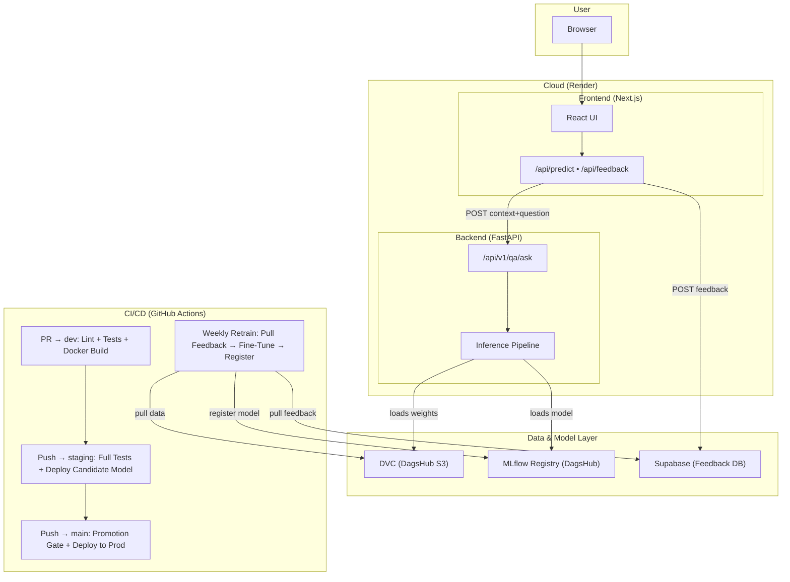

# Document QA Assistant: NLP & MLOps Final Project

This repository contains the integrated final project for the Master 2 (M2) courses: **"Natural Language Processing"** and **"MLOps"**. 

The objective is to develop a Closed-Domain Question Answering (QA) neural network and deploy it as a production-grade Web Application. This project demonstrates the full lifecycle of a machine learning model, from data engineering and model training to CI/CD pipelines, model registry, and cloud deployment.

## 👤 Contributors
* Alon DEBASC
* Axel STOLTZ
* Thibault CHESNEL

## 📋 Project Description

The system is designed to process "factoid" questions (e.g., "Where is the Louvre Museum located?") based on an input paragraph. The final product is a **"Document QA Assistant" Web Application**, allowing users to interact directly with the model and provide feedback to further augment the training dataset.

### Main Characteristics:
* **QA Type**: Closed-Domain (Factoid Questions).
* **Model**: Deep Neural Network (PyTorch/TensorFlow).
* **MLOps Lifecycle**: Strict Git Branching, DVC, MLflow Registry, and Automated CI/CD.
* **Architecture**: Node.js/React Frontend, Python (FastAPI/Flask) Backend.
* **Output**: An intelligible answer extracted from the text, served via API and highlighted in the UI.

---

## 📊 Dataset & Versioning

### Data Origin: SQuAD 2.0 + User Augmentation
The foundational data for this project comes from the **Stanford Question Answering Dataset (SQuAD) 2.0**.
*   **Content Base**: 500+ articles from Wikipedia (~150k questions).
*   **Format**: JSON format with `answer_start` indicators.
*   **Augmentation**: Through the UI's feedback loop, new `(Context, Question, Answer)` triplets are generated by users and appended to the dataset for continuous training.

### Data Versioning (DVC)
* All raw and expanded datasets are tracked using **DVC (Data Version Control)**.
* Remote storage (S3/Google Drive) is used to ensure all training runs are tied to a specific Git commit and data version.

---

## 🏗️ Architecture Diagram



## 🔄 CI/CD Pipeline

| Trigger | Workflow | Steps |
|---|---|---|
| **PR → `dev`** | `ci.yml` | Lint (Ruff) → Unit & Integration Tests → Docker Build (no push) |
| **Push → `staging`** | `deploy-staging.yml` | Full test suite → Docker Build → Deploy candidate model to Staging registry → Trigger Render staging deploy → E2E smoke tests |
| **PR → `main`** | `promotion-gate.yml` | Run MLflow F1 quality gate — blocks merge if threshold not met |
| **Push → `main`** | `deploy-prod.yml` | Promotion gate (F1 ≥ 0.5) → Promote model to Production stage → Trigger Render production deploy |
| **Weekly / Manual** | `retrain.yml` | Pull user feedback from Supabase → Fine-tune model → Register in MLflow → Commit DVC pointers |

## 🏆 Model Promotion

1. **Training** — model is trained/fine-tuned and registered in the MLflow Model Registry.
2. **Staging** — on push to `staging`, the latest model version is transitioned to `Staging` stage and deployed to the staging environment.
3. **Quality Gate** — on PR `staging → main`, the promotion gate script checks the model's F1 score against a threshold (≥ 0.5).
4. **Production** — if the gate passes, the model is promoted to `Production` stage, and Render deploys the new version to the production environment.
5. **Rollback** — if the gate fails, the model stays in `Staging` and production is **not** updated.

---

## 🛠️ Architecture and MLOps Methodology

### 1. Model Development (NLP)
* **Preprocessing**: Text cleaning, tokenization, vocabulary building.
* **Modeling**: Implementation of an Encoding/Attention neural network.
* **Training**: Executed on Google Colab with GPU acceleration.

### 2. Experiment Tracking & Registry (MLflow)
* All training experiments are logged using **MLflow** (metrics, parameters, and DVC data versions).
* The **Model Registry** serves as the single source of truth for deployments.

### 3. CI/CD & Quality Gates
* **Git Strategy**: Strict use of `feature/*`, `dev`, `staging`, and `main` branches.
* **GitHub Actions**: Automated testing (Unit, Integration, E2E) runs on Pull Requests.
* **Promotion Gates**: A model deployed to Staging must pass automated quality gates (e.g., F1 Score, Latency) before being promoted to the Production Registry.

### 4. Application Stack (12-Factor App)
* **Backend**: Python API serving the model.
* **Frontend**: React/Next.js interactive user interface.
* **Deployment**: Containerized and deployed on Cloud PaaS (e.g., Render, Railway) with environment-specific configurations.

---

## 🏃‍♂️ Getting Started

### Prerequisites
* **Python 3.12+**
* **[uv](https://docs.astral.sh/uv/)** — Python package manager
* **OneDrive Efrei** — synced on your machine (for accessing training data)

### 1. Clone & Install

```bash
git clone <repo-url>
cd NLP_MLOPS_Project
uv sync --dev
```

### 2. Setup Data (DVC)

The training data (~46MB) is stored via **DVC** on a shared OneDrive folder. Each team member needs to set this up **once**:

1. **Open the shared folder** in your browser:
   👉 [DVC Storage — OneDrive](https://efrei365net-my.sharepoint.com/:f:/g/personal/thibault_chesnel_efrei_net/IgDUIyJaL3Z9Q6Q4r8ch2WG-Ada88vuYFq3tm_xLQe-949Q?e=cYMPZa)

2. **Click "Ajouter un raccourci à Mes fichiers"** (Add shortcut to My files).
   This syncs the folder locally via OneDrive.

3. **Run the setup script** with **your** local synced path:
   ```bash
   # macOS example:
   ./scripts/setup_dvc.sh ~/Library/CloudStorage/OneDrive-Efrei/M2/S9/NLP/dvc-storage

   # Windows (Git Bash) example:
   ./scripts/setup_dvc.sh /c/Users/<YourName>/OneDrive\ -\ Efrei/M2/S9/NLP/dvc-storage
   ```

4. **Pull the data:**
   ```bash
   uv run dvc pull
   ```
   You should now have `data/train-v2.0.json` and `data/dev-v2.0.json`.

### 3. Run the Backend (FastAPI)

```bash
uv run uvicorn api.main:app --reload
```
API docs available at [http://127.0.0.1:8000/docs](http://127.0.0.1:8000/docs).

### 4. Run Tests & Linting

```bash
uv run pytest tests/ -v        # Run all tests
uv run ruff check .             # Lint
uv run ruff format .            # Auto-format
```

### 5. Git Workflow

All work follows the branching strategy: `feature/*` → `dev` → `staging` → `main`.

```bash
git checkout -b feature/my-feature dev
# ... make changes ...
git push origin feature/my-feature
# → Open a Pull Request to dev
```

---

## 🚀 Presentation and Demonstration

The project is the subject of a 15-minute presentation including:

* The methodology and intuition behind the chosen model.


* A complete description of the neural network layers.


* A comparison of results obtained versus the state of the art.


* A **live demonstration** via a pre-loaded notebook.


---

## 👥 Team

Project realized by a team of 3 students: **Alon DEBASC**, **Axel STOLTZ**, and **Thibault CHESNEL** under the supervision of instructor **Khodor Hammoud**.
